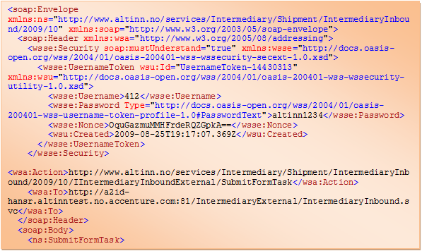
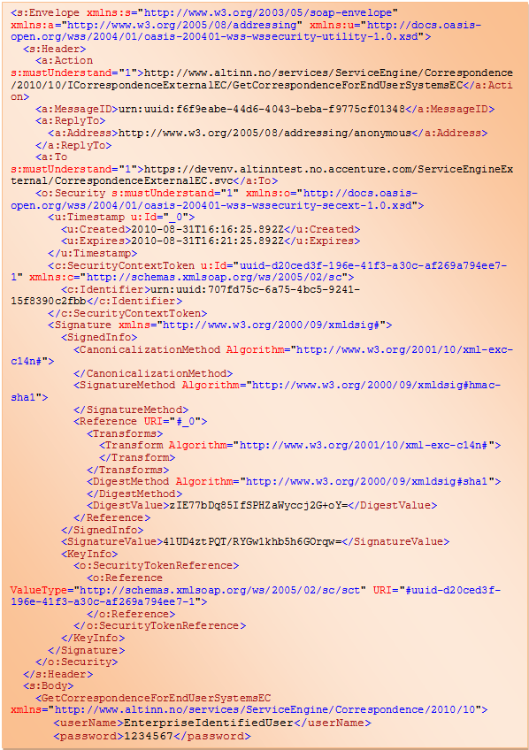
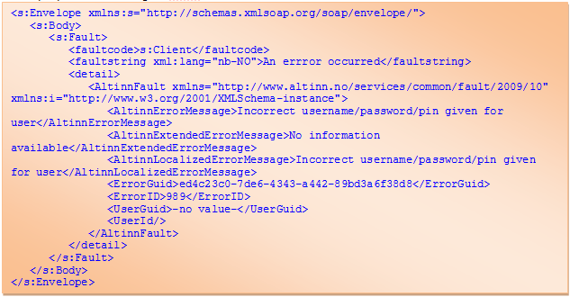

## Autentisering

- Basic operasjoner med autentiseringsinformasjon (brukernavn/passord) i meldingen.
- I en web service operasjon vil dette typisk bety at de første elementene i en melding er forbeholdt autentiseringsinformasjon.

Eksempel på en SOAP melding med basic:

- WS som benytter WS-Security hvor autentiseringsinformasjon (brukernavn/passord) følger SOAP meldingen på en standardisert måte gjennom definerte SOAP header elementer.

- I en web service operasjon vil dette bety at autentiseringsinformasjonen ligger i SOAP header basert på        innhold definert i WS-Security standarder.

Eksempel på en SOAP melding med bruk av WS-Security:

- EC operasjoner hvor autentiseringsinformasjon i form av sertifikat blir formidlet via SOAP header, mens tilhørende brukernavn og passord blir sent som del av meldingen.

Eksempel på en SOAP melding med bruk av EC:

Feilhåndtering
--------------

Altinn returnerer feilkoder hvis noe går galt. For å formidle feilsituasjonen benyttes en SOAP Fault med en egen kontrakt som inneholder felter som identifiserer feilen og gir en tekstlig feilmelding.

SOAP Fault
----------------

Altinn benytter en SOAP fault til å returnere feilmeldinger for en web service. Denne fault meldingen er i henholdt til AltinnFault kontrakten definert i WSDL for alle tjenestene. Kontrakten vil angi en feilkode og en feilmelding, henholdsvis *ErrorID* og *AltinnErrorMessage*, for å definere feilsituasjoner.

Eksempel på en feilmelding fra Altinn:

Feilkoder
----------------

Listen under angir de generelle feilkodene som benyttes.
Disse er først og fremst benyttet i sammenheng med autentisering og autorisering og benyttes derfor av flere av tjenestene i Altinn.

Feilkoder mer spesifikke for operasjonene er listet opp under de respektive operasjonene under [Grensesnitt](../grensesnitt).

| Feilkode | Beskrivelse                                                                                                                                                                                                                                                                                                                                                   |
| -------- | ------------------------------------------------------------------------------------------------------------------------------------------------------------------------------------------------------------------------------------------------------------------------------------------------------------------------------------------------------------- |
| 0        | Autentisering av sluttbruker feilet pga feil brukernavn/passord/pin. Maks bruk av pinkode oppnådd, benytt ny pinkode. Sesjon for pinkode har gått ut, benytt ny pinkode. Bruker er midlertidig låst                                                                                                                                                           |
| 5        | Ikke mulig å autorisere forespørsel basert på sendte parametere – verifiser gyldigheten/format. Autentisering av systemet feilet pga feil brukernavn/passord. Systemet eller virksomhetsbrukeren er midlertidig låst ute. Systemet er ikke autorisert for denne operasjonen på vegne av angitt avgiver. Angitt system ID er ikke gyldig – skal være et nummer |
| 989      | Autentisering av sluttbruker feilet pga feil brukernavn/passord/pin. Maks bruk av pinkode oppnådd, benytt ny pinkode. Sesjon for pinkode har gått ut, benytt ny pinkode. Bruker er midlertidig låst                                                                                                                                                           |

Hvis det ikke kommer en forståelig feilmelding, send en henvendelse til support@altinn.no.
Legg med tidspunkt for innsending, avgiver (reportee) og sluttbrukersystem id, den unike koden (ErrorGuid) samt beskrivelse av hva som har skjedd.

Benytt XMLDSig - digital signatur
---------------------------------

Noen tjenesteeiere krever *XMLDSig*-signering i tillegg til Altinns vanlige sikkerhetsfunksjoner. Altinn støtter skjema signert med *enveloped»-metoden*. Følgende XML viser hvordan signaturen skal dannes for å bli betraktet som gyldig av Altinn. Kanonisering (prosessen hvorved XML-dokumentet representeres på kanonisk form), signering og transformasjon må være samme som nedenfor; i tillegg må sertifikatet brukt for å signere dokumentet være inkludert i signaturen.

Nøyaktig ett «Signature»-element er tillatt i «XMLDSig»-elementet. Signaturen må være definert ifølge XMLDSig-navneromspesifikasjonen. Sertifikatet brukt for å signere dokumentet må være gyldig på det tidspunkt skjema leveres til Altinn. Skjemaene signerte med XMLDSig må sendes inn “komplett” og signaturen valideres av Altinn før skjemasendes videre til tjenesteeier. Tjenesteeier kan validere signaturen etter mottak fra Altinn. Merk at innhold i «XMLDSig»-elementet er definert i tjeneste-XSD-en som et *«any»-element* med *processContents=lax* og namespace lik XMLDSig-navnerommet. *Lax* prosessering betyr i praksis at ingen valideringsfeil resulterer hvis validatoren ikke er gitt et XSD-skjema som inkluderer XMLDSig-navnerommet, i.e. *XMLDSig-XSD*
